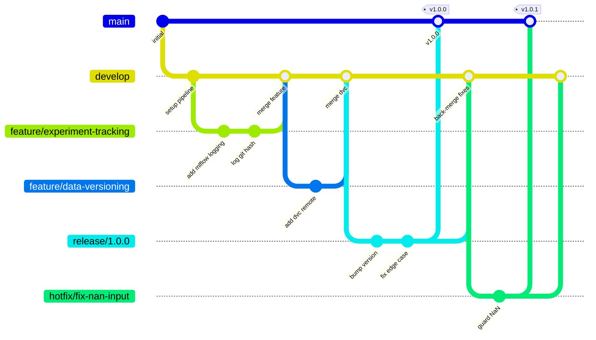

# 08 — Git & GitHub for MLOps

> **TL;DR**
> - Git is the version control system that makes your work reproducible and collaborative; GitHub is the hosting platform built on top of it.
> - Use Git Flow (main / develop / release / feature branches) to keep your ML project stable and auditable.
> - Treat commits, branch names, and pull requests as documentation — future you (and your teammates) will read them.

---

## 1. Why it matters

Every ML project eventually hits the same wall: *"Which version of the training script produced the model that's in production right now?"* Without disciplined version control, answering that question requires archaeology. With it, the answer is one command away.

Beyond reproducibility, Git solves three practical problems in ML teams:

- **Collaboration without overwriting.** Multiple people can work on feature engineering, model architecture, and serving code simultaneously without stepping on each other.
- **Auditability.** Regulators, stakeholders, and your own future self need to know what changed, when, and why. Git provides a tamper-evident log.
- **Safe experimentation.** Branches let you try a new architecture or data pipeline in isolation. If it works, you merge it. If it doesn't, you delete the branch and lose nothing.

Ignoring these practices doesn't hurt immediately — it hurts three months in, when you can't reproduce a result, can't onboard a new team member, or ship a regression because no one reviewed the change.

---

## 2. Core concepts

### 2.1 Git: the fundamentals

Git is a **distributed version control system**. Every developer has a full copy of the repository, including its entire history. There is no single "server" that holds the truth — although in practice, a remote repository (e.g., on GitHub) acts as the shared reference point.

**The three areas every developer works with:**

```
Working Directory  →  Staging Area (Index)  →  Repository (.git/)
   (your files)         git add                   git commit
```

- **Working directory**: the files you see and edit.
- **Staging area**: a preparation zone. You explicitly choose which changes to include in the next commit.
- **Repository**: the permanent record. Once committed, history is practically immutable.

**Key objects:**

- **Commit**: a snapshot of the entire project at a point in time, plus metadata (author, timestamp, message, parent commit hash). Identified by a SHA-1 hash (e.g., `a3f8c12`).
- **Branch**: a lightweight, movable pointer to a commit. Creating a branch costs nothing; it is just a file containing a hash.
- **Remote**: a named reference to another copy of the repository (typically `origin` for GitHub).
- **HEAD**: a pointer to the commit you currently have checked out. Usually points to the tip of a branch.

### 2.2 GitHub: the collaboration layer

GitHub is a hosted Git service that adds:

- **Pull Requests (PRs)**: a structured review process before merging code.
- **Branch protection rules**: enforce that code cannot be pushed to `main` without a PR, passing CI checks, and at least one approval.
- **Actions**: a CI/CD platform that runs workflows on push, PR, or schedule (covered in depth in the CI/CD for ML part).
- **Issues & Projects**: lightweight project management linked to code.

GitHub is the default in this handbook. Self-hosted alternatives (GitLab, Gitea) follow the same Git concepts with different UI.

### 2.3 Git Flow: the branching strategy

Git Flow defines a strict branch structure optimized for projects with scheduled releases and a need for a stable production line — which fits most ML systems well.



**Branch roles:**

| Branch | Purpose | Who merges into it | Deleted after merge? |
|---|---|---|---|
| `main` | Production-ready code only. Every commit here is deployable. | `release/*`, `hotfix/*` | No |
| `develop` | Integration branch. The next release is built here. | `feature/*`, `release/*`, `hotfix/*` | No |
| `feature/*` | One feature or experiment per branch. | Merges into `develop` | Yes |
| `release/*` | Stabilization before going to `main`. Only bug fixes allowed. | Merges into `main` AND `develop` | Yes |
| `hotfix/*` | Emergency fixes to production. | Merges into `main` AND `develop` | Yes |

---

## 3. Step-by-step implementation

### 3.1 Initial setup

```bash
# Set your identity — this appears in every commit you make
git config --global user.name "Your Name"
git config --global user.email "you@example.com"

# Use main as the default branch name (modern default)
git config --global init.defaultBranch main

# Set VS Code (or any editor) as the default for commit messages
git config --global core.editor "code --wait"
```

### 3.2 Starting a new project

```bash
# Initialize a new repo
git init mlops-handbook
cd mlops-handbook

# OR clone an existing one
git clone git@github.com:your-org/mlops-handbook.git
cd mlops-handbook

# Create the develop branch immediately
git checkout -b develop
git push -u origin develop
```

### 3.3 Branch naming conventions

Branch names are parsed by CI systems, referenced in PR titles, and read by teammates. Keep them machine-readable and human-meaningful.

**Pattern:** `<type>/<short-description>`

```
feature/add-mlflow-tracking
feature/dvc-s3-remote
feature/fastapi-serving-endpoint

release/1.2.0
release/2.0.0-rc1

hotfix/fix-null-prediction-crash
hotfix/patch-model-version-mismatch

experiment/xgboost-vs-lgbm       # for throwaway ML experiments — never merges to develop
```

Rules:

- All lowercase, hyphens only (no underscores, no slashes beyond the prefix separator).
- Descriptive enough to understand without opening GitHub. `feature/fix` is bad; `feature/add-data-drift-alerts` is good.
- Keep it under 50 characters.
- For experiments you may not merge (hyperparameter sweeps, architecture tries), prefix with `experiment/` so the team knows these are exploratory and may be abandoned.

### 3.4 The daily workflow

```bash
# Start a new feature — always branch from develop
git checkout develop
git pull origin develop          # always sync before branching
git checkout -b feature/add-mlflow-tracking

# Work, then stage only the relevant changes
git add src/mlops_handbook/pipelines/experiment_tracking/nodes.py
git add conf/base/parameters/experiment_tracking.yml

# Commit with a meaningful message (see section 3.5)
git commit -m "feat: log git commit hash to MLflow run metadata"

# Keep your branch up to date with develop (prefer rebase for clean history)
git fetch origin
git rebase origin/develop

# Push and open a PR
git push -u origin feature/add-mlflow-tracking
```

### 3.5 Writing good commit messages

A commit message is a letter to the next person who runs `git log` — often yourself in six months.

**Format: Conventional Commits**

```
<type>(<optional scope>): <short summary in imperative mood>

<optional body: what changed and why, not how>

<optional footer: breaking changes, issue refs>
```

**Types:**

| Type | When to use |
|---|---|
| `feat` | New feature or capability |
| `fix` | Bug fix |
| `refactor` | Code change that neither fixes a bug nor adds a feature |
| `test` | Adding or updating tests |
| `docs` | Documentation only |
| `chore` | Maintenance (dependency bumps, config updates) |
| `ci` | Changes to CI/CD workflows |
| `perf` | Performance improvement |
| `experiment` | Exploratory work, not necessarily permanent |

**Examples:**

```bash
# Good
git commit -m "feat(experiment-tracking): log git commit hash to MLflow run metadata"
git commit -m "fix(model-registry): handle missing model version in promote_model()"
git commit -m "docs: add common pitfalls section to data versioning guide"
git commit -m "chore: bump mlflow from 2.10.0 to 2.14.1"

# Bad — tells you nothing
git commit -m "fix stuff"
git commit -m "update"
git commit -m "WIP"
git commit -m "final version"
git commit -m "final version 2"
```

**Multi-line commit for complex changes:**

```bash
git commit
# Opens your editor. Write:
#
# feat(monitoring): add Evidently data drift report to monitoring pipeline
#
# Adds a new node `generate_drift_report` that runs the Evidently
# DataDriftPreset on the current batch vs. the training reference dataset.
# Report is saved to data/08_reporting/ and logged as an MLflow artifact.
#
# Drift threshold is configurable in conf/base/parameters/monitoring.yml.
# Closes #42
```

### 3.6 Pull requests

A PR is a review gate, not a formality. In ML projects, it is the last chance to catch a silent performance regression before it hits `develop`.

**PR title:** follow the same Conventional Commits format as commit messages.

**PR description template** (add to `.github/pull_request_template.md`):

```markdown
## What does this PR do?

<!-- One paragraph. What problem does it solve? -->

## How was it tested?

<!-- Unit tests? Manual run? On which dataset? -->

## MLOps checklist

- [ ] New nodes have type hints and Google-style docstrings
- [ ] Parameters are in `conf/base/parameters/<pipeline>.yml`, not hardcoded
- [ ] Catalog entries added/updated in `conf/base/catalog.yml`
- [ ] Tests added under `tests/pipelines/<pipeline>/`
- [ ] `ruff` and `black` pass locally (`make lint`)
- [ ] If a model is trained: metrics are logged to MLflow

## Related issues

Closes #
```

**Review etiquette:**

- Reviewers should comment on the *code*, not the author. "This function will silently return `None` on empty input" beats "You forgot to handle empty input."
- Authors should respond to every comment, even if just to say "good catch, fixed" or "I disagree because X, let's discuss."
- Approve only when you would be comfortable being paged at 2 AM about this code.

### 3.7 Creating a release

```bash
# Cut the release branch from develop
git checkout develop
git pull origin develop
git checkout -b release/1.2.0

# Bump version in pyproject.toml, update CHANGELOG
# Only bug fixes go here — no new features
git commit -m "chore: bump version to 1.2.0"

# Merge into main and tag
git checkout main
git merge --no-ff release/1.2.0
git tag -a v1.2.0 -m "Release v1.2.0: add data drift monitoring pipeline"
git push origin main --tags

# Back-merge into develop so it gets the fixes too
git checkout develop
git merge --no-ff release/1.2.0
git push origin develop

# Clean up
git branch -d release/1.2.0
git push origin --delete release/1.2.0
```

### 3.8 Hotfixes

```bash
# Branch from main — NOT from develop
git checkout main
git pull origin main
git checkout -b hotfix/fix-nan-prediction-crash

git commit -m "fix(serving): guard against NaN input in prediction endpoint"

# Merge into main
git checkout main
git merge --no-ff hotfix/fix-nan-prediction-crash
git tag -a v1.2.1 -m "Hotfix: guard NaN input in serving endpoint"
git push origin main --tags

# Also merge into develop
git checkout develop
git merge --no-ff hotfix/fix-nan-prediction-crash
git push origin develop

git branch -d hotfix/fix-nan-prediction-crash
```

### 3.9 Branch protection rules (GitHub settings)

Protect `main` and `develop` via **Settings → Branches → Add rule**:

**For `main`:**

```
Branch name pattern: main
☑ Require a pull request before merging
  ☑ Require approvals: 1
  ☑ Dismiss stale pull request approvals when new commits are pushed
☑ Require status checks to pass before merging
  ☑ Require branches to be up to date before merging
  Status checks: lint, test, validate-model  ← your GitHub Actions job names
☑ Require conversation resolution before merging
☑ Do not allow bypassing the above settings
```

**For `develop`:**

Same rules, but approvals can be set to 1 (or 0 for small teams — at minimum require CI to pass).

### 3.10 The `.gitignore` for an ML project

```gitignore
# Python
__pycache__/
*.py[cod]
*.egg-info/
dist/
.venv/
.env

# Kedro
conf/local/
!conf/local/.gitkeep

# Data — never commit data to git, use DVC instead
data/
!data/.gitkeep

# Models — tracked by MLflow / DVC, not git
*.pkl
*.joblib
*.pt
*.h5
*.onnx

# MLflow local tracking
mlruns/
mlartifacts/

# Notebooks (outputs, checkpoints)
.ipynb_checkpoints/
notebooks/*.nbconvert/

# OS
.DS_Store
Thumbs.db

# IDEs
.vscode/
.idea/
*.swp
```

> **Rule of thumb**: if a file is generated (can be reproduced from code + data), it does not belong in git. If it is configuration or source, it does. Data and models are versioned with DVC (see `docs/03_data_versioning.md`).

### 3.11 Useful daily commands

```bash
# See what's changed since last commit
git status
git diff                         # unstaged changes
git diff --staged                # staged changes

# Explore history
git log --oneline --graph --all  # visual branch graph
git log --oneline -20            # last 20 commits
git show a3f8c12                 # inspect a specific commit

# Undo things safely
git restore <file>               # discard unstaged changes in a file
git restore --staged <file>      # unstage a file (keep changes in working dir)
git revert HEAD                  # create a new commit that undoes the last one (safe for shared branches)

# DANGEROUS — only use on local, unshared commits
git reset --hard HEAD~1          # erase last commit and its changes entirely
git push --force-with-lease      # force push with a safety net (fails if remote has new commits)

# Find when a bug was introduced
git bisect start
git bisect bad                   # current commit is broken
git bisect good v1.1.0           # last known good tag
# git will now checkout midpoints; run your test, then:
git bisect good                  # or: git bisect bad
# repeat until git identifies the culprit commit
git bisect reset
```

---

## 4. MLOps-specific practices

### Log the git commit hash in every experiment

Your model artifact and your code must be permanently linked. MLflow makes this easy:

```python
# src/mlops_handbook/pipelines/experiment_tracking/nodes.py
import logging
import subprocess
from typing import Any

import mlflow

logger = logging.getLogger(__name__)


def get_git_commit_hash() -> str:
    """Return the current git commit hash (short form).

    Returns:
        7-character git commit hash, or 'unknown' if git is unavailable.
    """
    try:
        return subprocess.check_output(
            ["git", "rev-parse", "--short", "HEAD"],
            stderr=subprocess.DEVNULL,
        ).decode("utf-8").strip()
    except (subprocess.CalledProcessError, FileNotFoundError):
        logger.warning("Could not retrieve git commit hash.")
        return "unknown"


def log_run_metadata(
    params: dict[str, Any],
    metrics: dict[str, float],
    model_name: str,
) -> str:
    """Log parameters, metrics, and git provenance to an MLflow run.

    Args:
        params: Hyperparameters to log.
        metrics: Evaluation metrics to log.
        model_name: Name used to tag the run.

    Returns:
        The MLflow run ID.
    """
    with mlflow.start_run() as run:
        mlflow.set_tag("git_commit", get_git_commit_hash())
        mlflow.set_tag("model_name", model_name)
        mlflow.log_params(params)
        mlflow.log_metrics(metrics)
        logger.info("MLflow run %s logged successfully.", run.info.run_id)
        return run.info.run_id
```

### Never commit secrets

Credentials for S3, MLflow tracking servers, or model registries must live in `conf/local/credentials.yml`, which is git-ignored. If a secret is ever committed by accident:

```bash
# 1. Rotate the secret immediately — assume it is compromised
# 2. Remove it from history using git-filter-repo (NOT git filter-branch)
pip install git-filter-repo
git filter-repo --path conf/local/credentials.yml --invert-paths

# 3. Force push (coordinate with your team first)
git push origin --force --all
```

Use `git-secrets` or GitHub's built-in secret scanning to prevent this from happening in the first place.

### Tag every model-producing commit

When a model is promoted to production, tag the exact commit that produced it:

```bash
git tag -a model/churn-predictor/v3 -m "Model version 3: AUC 0.923 on holdout. MLflow run: a1b2c3d4"
git push origin model/churn-predictor/v3
```

This creates a permanent link between the artifact in the model registry and the code that produced it — no spreadsheet required.

### Use `--no-ff` when merging

Fast-forward merges erase the branching history, making it impossible to tell which commits belonged to which feature. Always use `--no-ff` for feature and release merges:

```bash
git merge --no-ff feature/add-drift-detection
```

In GitHub, this corresponds to the **"Create a merge commit"** option in the PR merge button. Disable "Allow squash merging" and "Allow rebase merging" in repository settings to enforce this team-wide.

---

## 5. Common pitfalls

**Committing to `main` or `develop` directly.** Enforce branch protection rules (section 3.9). Direct pushes bypass review and CI, and introduce unreviewed code into shared branches.

**Committing data files.** Git is not designed for large binary files. A 1 GB dataset committed to git bloats the repository permanently — even if you delete the file later, the history retains it. Use DVC (see `docs/03_data_versioning.md`).

**Using `git reset --hard` on shared branches.** This rewrites history and breaks every teammate's clone. Use `git revert` on shared branches — it adds a new commit that undoes the change without touching history.

**Vague commit messages.** `fix`, `update`, `WIP` are useless for debugging. The rule: the commit message should answer "why" (the code already shows "what").

**Long-lived feature branches.** The longer a branch lives, the more it diverges from `develop`, and the bigger the merge conflict. Keep feature branches short (days, not weeks). For large features, break them into smaller sub-tasks that each merge separately, and use feature flags to hide incomplete work in production.

**Not back-merging `release` or `hotfix` into `develop`.** Any fix made on a release or hotfix branch that is not back-merged into `develop` will be lost the next time `develop` is promoted. Always merge in both directions.

**Ignoring CI failures.** A red CI build is a signal, not a suggestion. Never merge a PR with failing checks. If the failure is a flaky test, fix the test — do not re-run until it passes by luck.

---

## 6. Further reading

- [Pro Git (free online book)](https://git-scm.com/book/en/v2) — the authoritative reference for everything Git.
- [Conventional Commits specification](https://www.conventionalcommits.org/en/v1.0.0/) — the full spec for the commit message format used in this handbook.
- [A successful Git branching model (Nvie)](https://nvie.com/posts/a-successful-git-branching-model/) — the original Git Flow article by Vincent Driessen.
