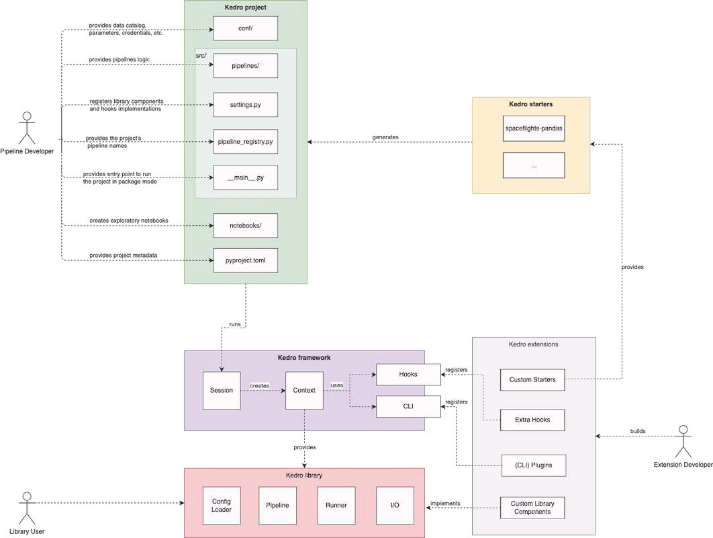

# Structure your repositories with Kedro

## Why Kedro?

### Key concepts

[Kedro](https://kedro.org) is package developped by [QuantumBlack](https://www.mckinsey.com/capabilities/quantumblack/how-we-help-clients), using the software engineering best practices to help you build production-ready data enginereering and data science.

* **Clean Code**: Kedro is the foundation for clean data engineering and data science code. It borrows concepts from software engineering and applies them to building data pipelines.
* **Handles Complexity**: A Kedro project provides scaffolding for complex data and machine-learning pipelines. You spend less time on tedious "plumbing" and focus instead on solving new problems.
* **Standardisation**: Kedro standardises how data engineering and data science code is created and ensures teams collaborate to solve problems easily.
* **Production-Ready**: Make a seamless transition from development to production with exploratory code that you can transition to reproducible, maintainable, and modular experiments.

### Features

* **Pipeline visualization**: Kedro-Viz is a blueprint of your data and machine-learning workflows. It provides data lineage, surfaces detailed pipeline execution information such as execution time, node status, dataset statistics, and makes it easier to collaborate with business stakeholders.\

* **Data catalog**: A series of lightweight data connectors used to save and load data across many different file formats and file systems. The Data Catalog supports S3, GCP, Azure, sFTP, DBFS, and local filesystems. Supported file formats include Pandas, Spark, Dask, NetworkX, Pickle, Plotly, Matplotlib, and many more. The Data Catalog also includes data and model snapshots for file-based systems.

* **Integrations**: Amazon SageMaker, Apache Airflow, Apache Spark, Azure ML, Dask, Databricks, Docker, fsspec, Jupyter Notebook, Kubeflow, Matplotlib, MLflow, Plotly, Pandas, VertexAI, and more.
* **Project template**: You can standardise how configuration, source code, tests, documentation, and notebooks are organised with an adaptable, easy-to-use project template. Create your cookie cutter project templates with Starters.
* **Dedicated IDE support**: The extension integrates Kedro projects with Visual Studio Code, providing features like enhanced code navigation and autocompletion for seamless development.
* **Pipeline abstraction**: You never have to label the running order of tasks in your pipeline because Kedro supports a dataset-driven workflow that supports automatic resolution of dependencies between pure Python functions.

* **Coding standards**: Test-driven development using pytest, produce well-documented code using Sphinx, create linted code with ruff and make use of the standard Python logging library.
* **Flexible deployment**: Deployment strategies that include single or distributed-machine deployment as well as additional support for deploying on Argo, Prefect, Kubeflow, AWS Batch, AWS Sagemaker, Databricks, Dask and more.

## Kedro architecture

Kedro has been developped to be used in multiple ways, taking only parts of the architecture, the whole architecture or event creating your own templates based on it. The way touse it is up to you. You can:
* Commit to using all of Kedro (framework, project, starters and library); which is preferable to take advantage of the full value proposition of Kedro
* You can use parts of Kedro, like the DataCatalog (I/O), OmegaConfigLoader, Pipelines and Runner, by using it as a Python library; this best supports a workflow where you don't want to adopt the Kedro project template
* Or, you can develop extensions for Kedro e.g. custom starters, plugins, Hooks and more

The overall architecture of Kedro:

The repository created by Kedro will look like this:
* A **pyproject.toml** file which contains all the parameters of the project, like the name of project, the python dependencies or the Ruff rules.
* A **conf/** directory, which contains all the parameters and catalog yaml files.
  * The **parameters_<name_parameter>.yml** files, one file per pipeline which contains the parameters used by this pipeline.
  * The **globals.yml** file, which contains the parameters shared by several or all pipelines.
  * The **catalog.yml** file, which contains all the datasets, figures, etc. to save to a file and to share between the pipelines.
* The **src/** directory which contains the source code for your pipelines:
    * The **pipelines/** directory which contains the source code of the different pipelines, with nodes.py and pipeline.py files.
    * The **settings.py** file contains the settings for the project, such as library component registration, custom hooks registration, etc. All the available settings are listed and explained in the project settings chapter.
    * The **pipeline_registry.py** file defines the project pipelines, i.e. pipelines that can be run using `kedro run --pipeline`.
    * The **__main__.py** file serves as the main entry point of the project in package mode.

## Kedro library

Kedro library consists of independent units, each responsible for one aspect of computation in a data pipeline:
* **kedro.config.OmegaConfigLoader** provides utility to parse and load configuration defined in a Kedro project.
* **kedro.pipeline** provides a collection of abstractions to model data pipelines.
* **kedro.runner** provides an abstraction for different execution strategy of a data pipeline.
* **kedro.io** provides a collection of abstractions to handle I/O in a project, including DataCatalog and many Dataset implementations.

## How to use Kedro for your data science project?

