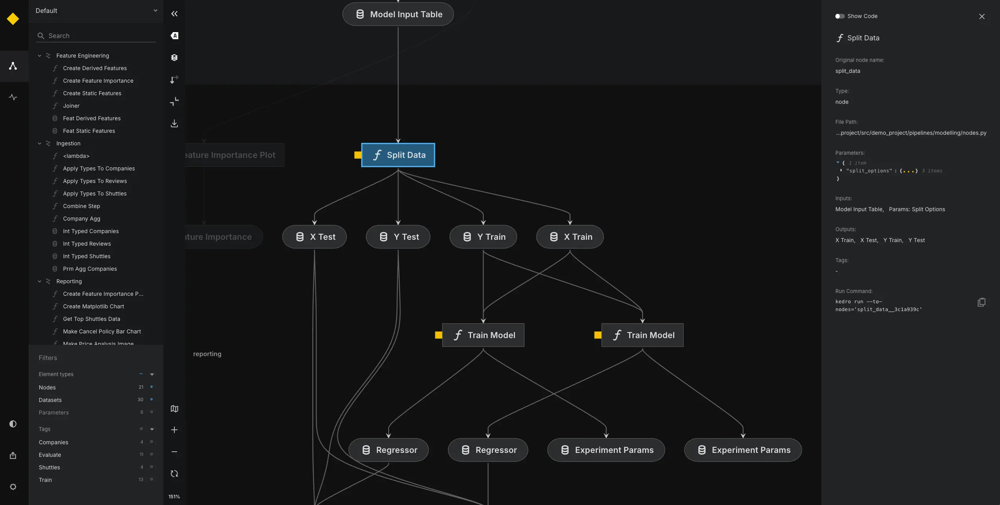
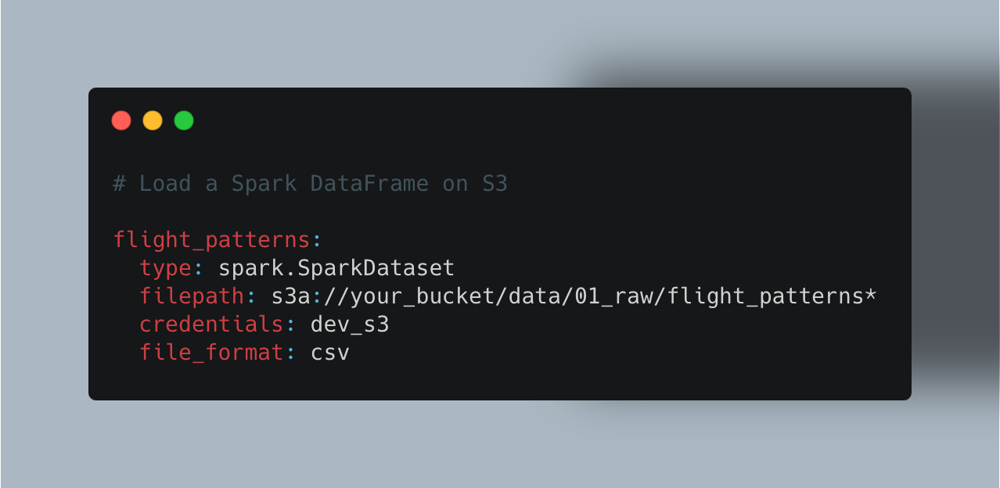
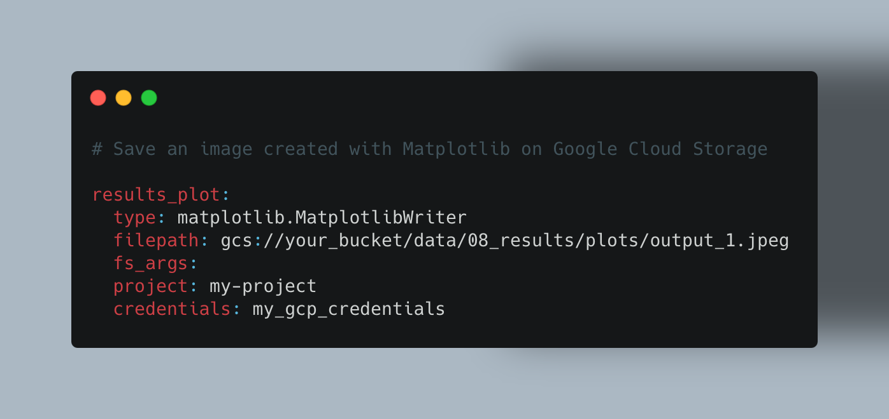
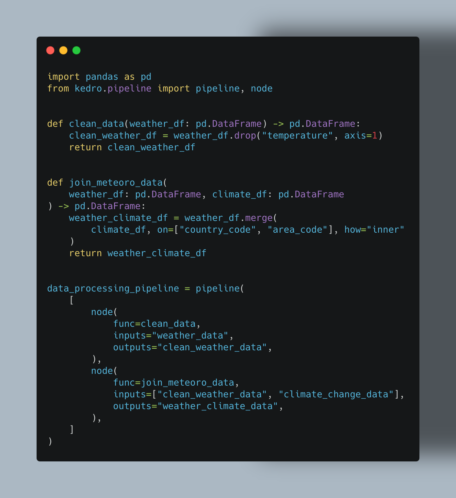

# Structure your repositories with Kedro

## Why Kedro?

### Key concepts

[Kedro](https://kedro.org) is package developped by [QuantumBlack](https://www.mckinsey.com/capabilities/quantumblack/how-we-help-clients), using the software engineering best practices to help you build production-ready data enginereering and data science.

* **Clean Code**: Kedro is the foundation for clean data engineering and data science code. It borrows concepts from software engineering and applies them to building data pipelines.
* **Handles Complexity**: A Kedro project provides scaffolding for complex data and machine-learning pipelines. You spend less time on tedious "plumbing" and focus instead on solving new problems.
* **Standardisation**: Kedro standardises how data engineering and data science code is created and ensures teams collaborate to solve problems easily.
* **Production-Ready**: Make a seamless transition from development to production with exploratory code that you can transition to reproducible, maintainable, and modular experiments.

### Features

* **Pipeline visualization**: Kedro-Viz is a blueprint of your data and machine-learning workflows. It provides data lineage, surfaces detailed pipeline execution information such as execution time, node status, dataset statistics, and makes it easier to collaborate with business stakeholders.\

* **Data catalog**: A series of lightweight data connectors used to save and load data across many different file formats and file systems. The Data Catalog supports S3, GCP, Azure, sFTP, DBFS, and local filesystems. Supported file formats include Pandas, Spark, Dask, NetworkX, Pickle, Plotly, Matplotlib, and many more. The Data Catalog also includes data and model snapshots for file-based systems.

* **Integrations**: Amazon SageMaker, Apache Airflow, Apache Spark, Azure ML, Dask, Databricks, Docker, fsspec, Jupyter Notebook, Kubeflow, Matplotlib, MLflow, Plotly, Pandas, VertexAI, and more.
* **Project template**: You can standardise how configuration, source code, tests, documentation, and notebooks are organised with an adaptable, easy-to-use project template. Create your cookie cutter project templates with Starters.
* **Dedicated IDE support**: The extension integrates Kedro projects with Visual Studio Code, providing features like enhanced code navigation and autocompletion for seamless development.
* **Pipeline abstraction**: You never have to label the running order of tasks in your pipeline because Kedro supports a dataset-driven workflow that supports automatic resolution of dependencies between pure Python functions.

* **Coding standards**: Test-driven development using pytest, produce well-documented code using Sphinx, create linted code with ruff and make use of the standard Python logging library.
* **Flexible deployment**: Deployment strategies that include single or distributed-machine deployment as well as additional support for deploying on Argo, Prefect, Kubeflow, AWS Batch, AWS Sagemaker, Databricks, Dask and more.
