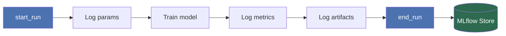

# Experiment Tracking with MLflow

> **TL;DR**
> - Without experiment tracking, model training is a black box: you can't reproduce results, compare runs, or explain decisions.
> - MLflow gives you a structured, queryable history of every training run — params, metrics, and artifacts — with near-zero setup overhead.
> - Tracking the git commit hash alongside every run ties your code to your results; skip it and reproducibility is a lie.

---

## 1. Why It Matters

You train a model. It performs well. Two weeks later, your colleague asks: "Which features did you use? What was the learning rate? Which dataset version?" You open three notebooks, two Slack threads, and a spreadsheet you vaguely remember making.

This is the experiment tracking problem. It is not exotic — it happens to every data scientist who hasn't solved it deliberately.

The consequences compound quickly:

- **You can't reproduce your best run.** You know it happened, but not how.
- **You can't compare approaches rigorously.** Mental comparisons across notebooks are not comparisons.
- **You can't explain your model to stakeholders or auditors.** "I think I used these features" is not an answer in production.
- **Collaboration breaks.** Your teammate can't build on your work without re-running everything.

MLflow solves this by recording every training run in a structured, searchable store. It is open-source, self-hostable, and has become the de-facto standard in the MLOps ecosystem because it requires almost no infrastructure to start and scales to large teams without replacement.

> **Alternatives:** Weights & Biases (W&B) and Neptune.ai offer similar tracking with richer managed UIs. Both are excellent but are SaaS-first. MLflow is the default here because you can run it entirely on your own infrastructure.

---

## 2. Core Concepts

### 2.1 The Tracking Hierarchy

MLflow organises runs in a two-level hierarchy:

```
Experiment
└── Run
    ├── Parameters   (hyperparameters, config values)
    ├── Metrics      (loss, accuracy, F1 — scalable over time)
    ├── Artifacts    (model files, plots, preprocessors)
    └── Tags         (metadata: git hash, dataset version, author)
```

**Experiment** — a named collection of runs, typically one per modelling task (e.g., `churn_prediction`). Think of it as a project folder.

**Run** — a single execution of your training script. Every run gets a unique `run_id` (UUID) that is your primary handle for retrieving results later.

**Parameters** — things you set before training. Logged once. Examples: `learning_rate=0.01`, `max_depth=5`, `n_estimators=100`.

**Metrics** — things you measure during or after training. Can be logged at each epoch (step-aware). Examples: `val_loss`, `f1_score`, `roc_auc`.

**Artifacts** — files produced by a run. Examples: the serialised model, a confusion matrix plot, the fitted scaler. Stored in the artifact store (local or remote).

**Tags** — arbitrary key-value metadata. The most important tag you will ever set is `mlflow.source.git.commit` — the git commit hash of the code that produced this run.

### 2.2 The Tracking Server

MLflow can log to three backend configurations:

| Setup | Tracking URI | When to use |
|---|---|---|
| Local filesystem | `mlruns/` (default) | Solo development, getting started |
| Local MLflow server | `http://localhost:5000` | Team sharing on a single machine |
| Remote server | `http://your-server:5000` | Production, multi-user teams |

In all cases, the API is identical. You set the tracking URI once; the rest of your code does not change.

### 2.3 The Run Lifecycle



The `mlflow.start_run()` context manager handles `start_run` and `end_run` automatically, including on exception. Always use it as a context manager — never call `mlflow.end_run()` manually.

---

## 3. Setup

### 3.1 Installation

```bash
pip install mlflow
```

No additional services required for local tracking. MLflow creates a `mlruns/` directory in your working directory on first use.

### 3.2 Starting the Tracking UI

```bash
mlflow ui --host 0.0.0.0 --port 5000
```

Open `http://localhost:5000`. You will see all experiments and runs logged from the current directory.

### 3.3 Pointing at a Remote Server (optional)

```python
import mlflow

mlflow.set_tracking_uri("http://your-mlflow-server:5000")
```

Set this once at the top of your training script, or via the environment variable:

```bash
export MLFLOW_TRACKING_URI=http://your-mlflow-server:5000
```

The environment variable is preferred in production — it keeps the URI out of your code and makes the script portable across environments.

---

## 4. Step-by-Step Implementation

### 4.1 A Minimal Tracked Training Script

```python
# src/mlops_handbook/pipelines/experiment_tracking/nodes.py

import logging
import subprocess
from pathlib import Path
from typing import Any

import mlflow
import mlflow.sklearn
import pandas as pd
from sklearn.ensemble import RandomForestClassifier
from sklearn.metrics import f1_score, roc_auc_score
from sklearn.model_selection import train_test_split

logger = logging.getLogger(__name__)


def get_git_commit_hash() -> str:
    """Return the current git commit hash, or 'unknown' if not in a git repo.

    Returns:
        The short 8-character git commit hash.
    """
    try:
        result = subprocess.run(
            ["git", "rev-parse", "--short", "HEAD"],
            capture_output=True,
            text=True,
            check=True,
        )
        return result.stdout.strip()
    except subprocess.CalledProcessError:
        logger.warning("Could not retrieve git commit hash.")
        return "unknown"


def train_classifier(
    features: pd.DataFrame,
    target: pd.Series,
    params: dict[str, Any],
) -> tuple[RandomForestClassifier, dict[str, float]]:
    """Train a Random Forest classifier and log the run to MLflow.

    Args:
        features: Feature matrix.
        target: Binary target vector.
        params: Hyperparameters. Must contain 'n_estimators', 'max_depth',
            'random_state', and 'test_size'.

    Returns:
        A tuple of (trained model, metrics dict).
    """
    X_train, X_val, y_train, y_val = train_test_split(
        features,
        target,
        test_size=params["test_size"],
        random_state=params["random_state"],
    )

    mlflow.set_experiment("churn_prediction")

    with mlflow.start_run():
        # --- Always log the git hash first ---
        mlflow.set_tag("git_commit", get_git_commit_hash())

        # --- Log all hyperparameters ---
        mlflow.log_params(
            {
                "n_estimators": params["n_estimators"],
                "max_depth": params["max_depth"],
                "random_state": params["random_state"],
                "test_size": params["test_size"],
            }
        )

        # --- Train ---
        model = RandomForestClassifier(
            n_estimators=params["n_estimators"],
            max_depth=params["max_depth"],
            random_state=params["random_state"],
        )
        model.fit(X_train, y_train)

        # --- Evaluate ---
        y_pred = model.predict(X_val)
        y_prob = model.predict_proba(X_val)[:, 1]

        metrics = {
            "val_f1": f1_score(y_val, y_pred),
            "val_roc_auc": roc_auc_score(y_val, y_prob),
        }

        # --- Log metrics ---
        mlflow.log_metrics(metrics)

        # --- Log the model as an artifact ---
        mlflow.sklearn.log_model(
            sk_model=model,
            artifact_path="random_forest",
            registered_model_name="churn_classifier",  # registers in Model Registry
        )

        logger.info("Run logged. Metrics: %s", metrics)

    return model, metrics
```

### 4.2 Parameters File

Keep all hyperparameters in `conf/base/parameters/experiment_tracking.yml`. Never hardcode them in the training script.

```yaml
# conf/base/parameters/experiment_tracking.yml

n_estimators: 200
max_depth: 8
random_state: 42
test_size: 0.2
```

### 4.3 Logging Metrics Over Time (Epochs)

For iterative training (neural networks, gradient boosting with staged logging), pass `step` to `log_metric`:

```python
for epoch in range(num_epochs):
    loss = train_one_epoch(model, train_loader)
    val_loss = evaluate(model, val_loader)

    mlflow.log_metric("train_loss", loss, step=epoch)
    mlflow.log_metric("val_loss", val_loss, step=epoch)
```

The MLflow UI will render these as line charts. You can overlay multiple runs to compare convergence curves directly.

### 4.4 Logging Custom Artifacts

Any file can be logged as an artifact. Common examples:

```python
import matplotlib.pyplot as plt
from sklearn.metrics import ConfusionMatrixDisplay

with mlflow.start_run():
    # ... train and evaluate ...

    # Log a confusion matrix plot
    fig, ax = plt.subplots()
    ConfusionMatrixDisplay.from_predictions(y_val, y_pred, ax=ax)
    fig.savefig("/tmp/confusion_matrix.png")
    mlflow.log_artifact("/tmp/confusion_matrix.png", artifact_path="plots")

    # Log the feature list used for training
    feature_path = Path("/tmp/features_used.txt")
    feature_path.write_text("\n".join(features.columns.tolist()))
    mlflow.log_artifact(str(feature_path), artifact_path="metadata")
```

Artifacts are stored in the artifact store and linked to the run. You can retrieve them programmatically using the `run_id`.

### 4.5 Autologging (with Caveats)

MLflow provides `mlflow.autolog()` to automatically capture params, metrics, and the model for supported frameworks:

```python
import mlflow

mlflow.autolog()

# sklearn, XGBoost, LightGBM, PyTorch Lightning, etc.
# now log automatically on fit()
model.fit(X_train, y_train)
```

**Use autologging for exploration only.** In production pipelines, log explicitly. Reasons:

- Autologging captures everything, including params you didn't intend to track, producing noisy run histories.
- It gives you no control over what gets logged or how it's named.
- It breaks when you upgrade framework versions, silently dropping metrics.

Explicit logging is two extra lines per metric. It is worth it.

---

## 5. Querying Runs Programmatically

The MLflow tracking API lets you search runs without the UI:

```python
import mlflow

client = mlflow.tracking.MlflowClient()

# Find the best run in an experiment by val_roc_auc
runs = client.search_runs(
    experiment_ids=["1"],  # experiment ID, visible in the UI URL
    filter_string="metrics.val_roc_auc > 0.85",
    order_by=["metrics.val_roc_auc DESC"],
    max_results=5,
)

for run in runs:
    print(run.info.run_id, run.data.metrics["val_roc_auc"])
```

This is how you automate model promotion: query for the best run, validate it meets your threshold, then register or promote it. You are never clicking through a UI in a production pipeline.

---

## 6. Common Pitfalls

**Not logging the git commit hash.**
This is the most common omission and the most damaging. Without it, you cannot tie a run's results back to the code that produced them. Make `get_git_commit_hash()` a utility function in your codebase and call it at the start of every run, unconditionally.

**Logging inside a loop without `step`.**
Calling `mlflow.log_metric("loss", value)` 100 times inside a training loop without a `step` argument overwrites the metric each time. Only the last value is stored. Use `step=epoch`.

**One experiment for everything.**
Putting all your runs in the default experiment makes the UI useless within a week. Create one experiment per modelling task, named descriptively: `fraud_detection_v2`, not `experiment_3`.

**Logging params after training.**
Log params before calling `fit()`. If your training crashes mid-run, you want the params that caused the crash recorded, not absent.

**Hardcoding the tracking URI.**
`mlflow.set_tracking_uri("http://192.168.1.42:5000")` in your code will break for every other developer on the team. Use the `MLFLOW_TRACKING_URI` environment variable.

**Using `mlflow.end_run()` explicitly.**
If your script raises an exception before reaching `mlflow.end_run()`, the run stays open in the `RUNNING` state indefinitely and won't appear in search results correctly. Always use `with mlflow.start_run():`.

---

## 7. Further Reading

- [MLflow Tracking documentation](https://mlflow.org/docs/latest/tracking.html) — official reference for all logging APIs
- [MLflow Models documentation](https://mlflow.org/docs/latest/models.html) — model flavours, signatures, and input examples
- [Reproducible Machine Learning with MLflow](https://mlflow.org/docs/latest/projects.html) — MLflow Projects for packaging training code
